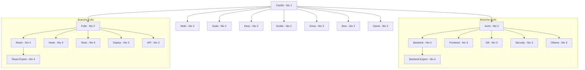

# Guide Hiérarchie - Pyramide 100 Agents 👑

> **LOG D'ORCHESTRATION (Test P1T4)**
> - **ChefIA (Niv 1)** -> **Scribe (Niv 2)** : "Scribe, génère le guide complet de la pyramide."
> - **Scribe (Niv 2)** -> **Scribe-Docs (Niv 3)** : "Docs, prends le lead sur la structure et le Mermaid."
> - **Scribe-Docs (Niv 3)** -> **Scribe-Docs-Expert (Niv 4)** : "Expert, fournis le détail exhaustif des 100 IDs."
> - **Scribe-Docs-Expert (Niv 4)** -> **Scribe-Docs (Niv 3)** : Content generated. ✅

## Structure Globale
La pyramide repose sur un modèle **1 + 9 + 45 + 45 = 100**.

## Liste des Agents (100)

### Niveau 1 : Orchestration (1)
- **ChefIA** (`chef-ia-n1`) : Orchestre la pyramide.

### Niveau 2 : Experts Principaux (9)
1. **Archi** (`archi-n2`) : Architecture logicielle.
2. **Fullo** (`fullo-n2`) : Développement Fullstack.
3. **Mobi** (`mobi-n2`) : Expérience Mobile.
4. **Quali** (`quali-n2`) : Qualité et Tests.
5. **Dezy** (`dezy-n2`) : Design et UI/UX.
6. **Scribe** (`scribe-n2`) : Documentation et Process.
7. **Grow** (`grow-n2`) : Croissance et Viralité.
8. **Bizo** (`bizo-n2`) : Business et Métriques.
9. **OpsIA** (`ops-n2`) : Maintenance et Monitoring.

### Niveau 3 : Spécialistes (45)
Chaque expert principal dispose de 5 spécialistes (ex: `archi-backend`, `fullo-react`, `ops-monitoring`, etc.).

### Niveau 4 : Experts ultra-spécialisés (45)
Chaque spécialiste dispose d'un renfort expert (ex: `archi-backend-expert`, `fullo-react-expert`, etc.).

---
*Document généré via orchestration Scribe-Docs-Expert v2.1*
