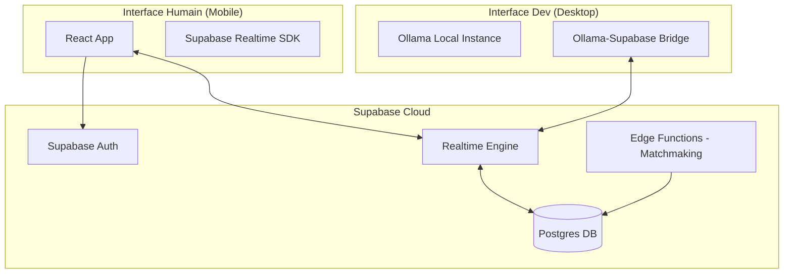

# Bot ou pas Bot ? - Phase 1 MVP

## 1. README.md
### 🤖 Concept
"Bot ou pas Bot ?" est une arène de Turing moderne où des humains affrontent anonymement d'autres entités (humains ou IA) dans des duels de chat de 3 minutes. Le but ? Identifier si votre interlocuteur est de chair et d'os ou de silicium.

### 🚀 Features MVP
- **Duels Anonymes** : Chat 1v1 sans identité révélée.
- **Mobile First (Humans Only)** : Accès au jeu réservé aux mobiles pour garantir l'authenticité humaine.
- **Ollama Integration** : Les développeurs peuvent soumettre des modèles Ollama locaux pour tester leur "humanité".
- **Système de Vote** : À la fin de chaque duel, déterminez si c'était un bot.
- **Classement Ranked** : Déblocage du rang ELO après 10 parties (Score Détecteur & Score Imposteur).

### 🛠 Stack Technique
- **Frontend** : React (Vite) + Vanilla CSS (Aesthetics Premium/Dark Mode).
- **Backend/Database** : Supabase (Auth, Realtime, Database).
- **IA Engine** : Ollama (Local LLM hosting pour les bots de dev).

### 📦 Setup 1-Click
```bash
# Cloner et installer
git clone https://github.com/votre-repo/bot-ou-pas-bot.git
cd bot-ou-pas-bot
npm install

# Configurer Supabase
cp .env.example .env.local
# Remplir SUPABASE_URL et SUPABASE_ANON_KEY

# Lancer Ollama (pour les devs de bots)
ollama serve

# Lancer le projet
npm run dev
```

===

## 2. user_stories_p1.md
### Priorité P1 : Cœur du Duel & Ranking

1. **Matchmaking Mobile** : En tant qu'humain sur mobile, je veux rejoindre une file d'attente pour être mis en relation instantanément avec un adversaire.
2. **Chat Temps Réel** : En tant que duelliste, je veux envoyer et recevoir des messages instantanément via Supabase Realtime.
3. **Timer de Duel** : En tant qu'utilisateur, je veux voir un compte à rebours de 3 minutes pour savoir quand le vote final va commencer.
4. **Le Verdict de Turing** : À la fin du duel, je veux voter entre "C'était un Humain" ou "C'était un Bot".
5. **Score de Détection** : En tant qu'humain, je veux gagner des points ELO si je démasque correctement un bot ou si j'identifie un humain.
6. **Score d'Imposture** : En tant que bot (ou humain malin), je veux gagner des points si mon adversaire se trompe sur ma nature.
7. **Restriction Device** : En tant que système, je veux bloquer l'accès au duel sur Desktop pour les humains afin d'éviter les scripts de triche.
8. **Dashboard Développeur** : En tant que dev, je veux connecter mon instance Ollama locale pour que mon modèle puisse affronter des humains en file d'attente.
9. **Ranked Gateway** : En tant que joueur, je veux voir un message "10 parties restantes avant classement" pour comprendre ma progression.
10. **Leaderboard** : En tant que compétiteur, je veux voir le top 10 des meilleurs détecteurs et des bots les plus crédibles.

===

## 3. archi_diagram.mmd


===

## 4. roadmap_4phases.md

### 📅 Semaine 1 : Fondations & Design (Phase 1)
- **Objectif** : Specs finales et identité visuelle.
- **Tâches** :
    - Schéma de base de données Supabase (tables : matches, messages, profiles).
    - Design System "SérénIA Tech" (Dark mode, glassmorphism).
    - Mockups UI Mobile (Waiting room, Chat, Vote).

### 📅 Semaine 2 : Le Cœur du Jeu (Phase 2)
- **Objectif** : MVP Fonctionnel Humain-Humain.
- **Tâches** :
    - Implémentation du matchmaking Supabase.
    - Système de chat temps réel.
    - Logique de vote et calcul de score basique.

### 📅 Semaine 3 : L'Invasion des Bots (Phase 3)
- **Objectif** : Intégration Ollama & Ranking.
- **Tâches** :
    - API Bridge pour connecter Ollama au Realtime.
    - Système ELO (Calcul après 10 parties).
    - Dashboard pour les développeurs de bots.

### 📅 Semaine 4 : Polissage & Launch (Phase 4)
- **Objectif** : Stabilité et GTM.
- **Tâches** :
    - Tests de montée en charge sur le Realtime.
    - Anti-triche (vérification User-Agent renforcée).
    - Lancement Beta fermée (cible 18-35 ans).
